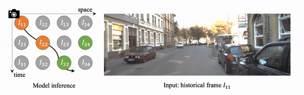

# Video Extrapolation in Space and Time

Official PyTorch Implementation of paper "Video Extrapolation in Space and Time", ECCV 2022.

[Yunzhi Zhang](https://cs.stanford.edu/~yzzhang), [Jiajun Wu](https://jiajunwu.com/)

Stanford University

[[arXiv]](https://arxiv.org/abs/2205.02084)
[[Page]](https://cs.stanford.edu/~yzzhang/projects/vest/)



## Installation

First, install pytorch and torchvision following the official [doc](https://pytorch.org/get-started/locally/).
Then run 
```
pip install -r requirements.txt
```

## Dataset
Follow the following links to download the original dataset:
1. [KITTI](http://www.cvlibs.net/datasets/kitti/raw_data.php);
2. [RealEstate10K](https://google.github.io/realestate10k/);
3. [CATER](https://github.com/rohitgirdhar/CATER);
4. [Lin et al.](https://github.com/ken2576/deep-3dmask);
5. [Cloud](https://drive.google.com/file/d/1YnyQrgdErTMV2lNa--sm6L4K7K1piagO/view?usp=sharing).

## Training

To train the model, run the following command:
```
python train.py configs/kitti/base.yaml -d kitti_city --single_gpu
```

## Evaluation

To compute quantitative results, run the following command:
```
python compute_scores.py PATH_TO_CHECKPOINT
```

To generate qualitative results, run
```
python vest/inference/show_estate.py PATH_TO_CHECKPOINT
```

## Acknowledgements

This codebase is built on top of [Imaginare](https://github.com/NVlabs/imaginaire).
